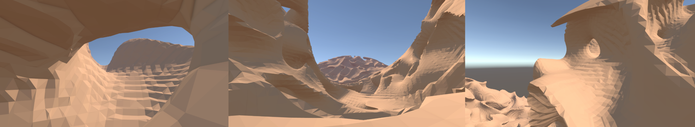
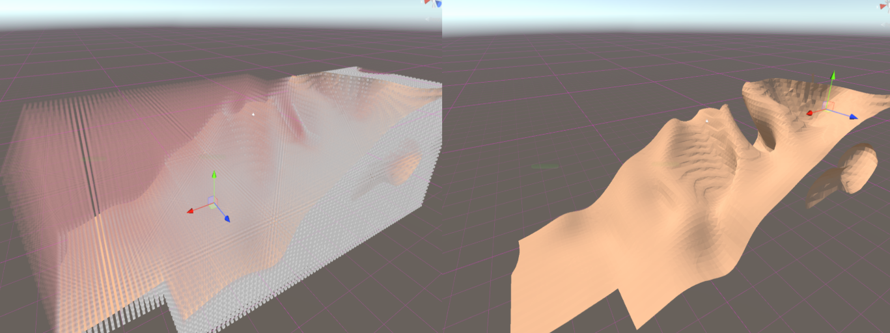

# Marching Cubes Terrain

This Unity project explores procedurally generated 3D terrain using marching cubes and a scalar field. The terrain supports complex geometry, including overhangs and caves.

## Features

- **Scalar Field-Based Terrain**  
  Terrain is generated from a scalar field stored in a dictionary keyed by `Vector3Int`. Each field value is sampled, cached, and generated through a strategie pattern.

- **Marching Cubes Mesh Generation**  
  Chunks are polygonized using the marching cubes algorithm, creating smooth, curved surfaces based on field thresholds.

- **Chunk Streaming System**  
  A `ChunkManager` handles loading and unloading terrain around the player. Chunks are tracked via dictionary and hash set, and generated only when needed.

- **Procedural Generation Strategies**  
  Supports multiple noise types (Perlin, fractional Brownian motion, and flow fields) through interchangeable strategies. Each can be tested independently and combined for final generation.

- **Editor Gizmo Visualization**  
  Field values are visualized in the editor for easier debugging and iteration.
  

## How It Works

- Scalar values are generated with a `ScalarPopulateStrategy` and cached in a dictionary.  
- Chunks are created around a target object using a fixed range..  
- Each chunk samples the scalar field and applies marching cubes to produce a mesh.  

## Areas for Improvement

- Expose generation strategy options to the Unity Editor for better design control  
- Add chunk pooling to reduce instantiation overhead  
- Implement LOD system to improve rendering performance  
- Explore multithreading for mesh generation

## Future Plans

This system is a strong foundation for procedural games with destructible or large-scale environments. It could be used for:

- Open-world prototyping
- Destructible terrain systems
- Procedural level design as a gameplay mechanic

Modifying the scalar field and regenerating chunks already opens up possibilities for terrain deformation and dynamic environments.

## References

- [Generating Complex Procedural Terrains Using GPU (NVIDIA)](https://developer.nvidia.com/gpugems/gpugems3/part-i-geometry/chapter-1-generating-complex-procedural-terrains-using-gpu)  
- [Flow Field from Noise (PeerPlay)](https://www.youtube.com/watch?v=gPNdnIMbe8o&ab_channel=PeerPlay)  
- [Marching Cubes Algorithm (Paul Bourke)](https://paulbourke.net/geometry/polygonise/)  
- [3D Perlin Noise (Keijiro)](https://github.com/keijiro/PerlinNoise)  
- [fBm Overview (StackExchange)](https://gamedev.stackexchange.com/questions/197861/how-to-handle-octave-frequency-in-the-perlin-noise-algorithm)  
- [Terrain Generation (Sebastian Lague)](https://www.youtube.com/watch?v=kM6yRUOnrI8&ab_channel=SebastianLague)
